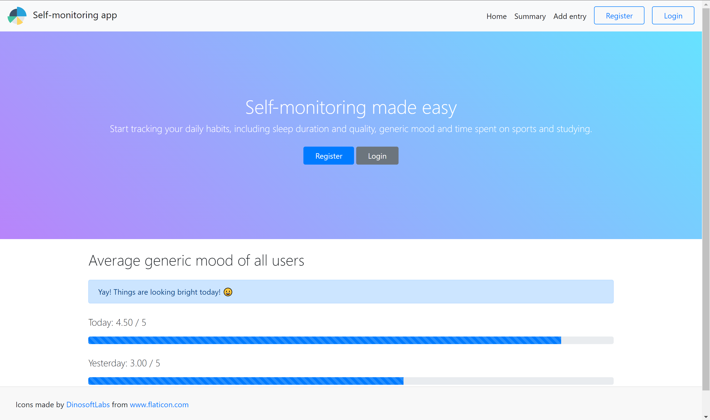
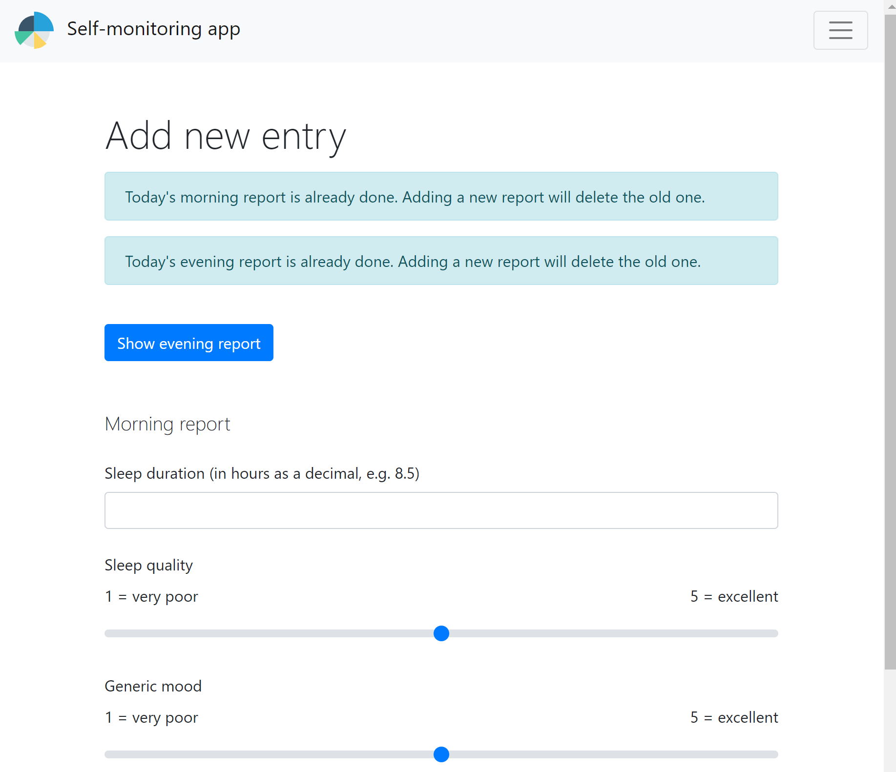
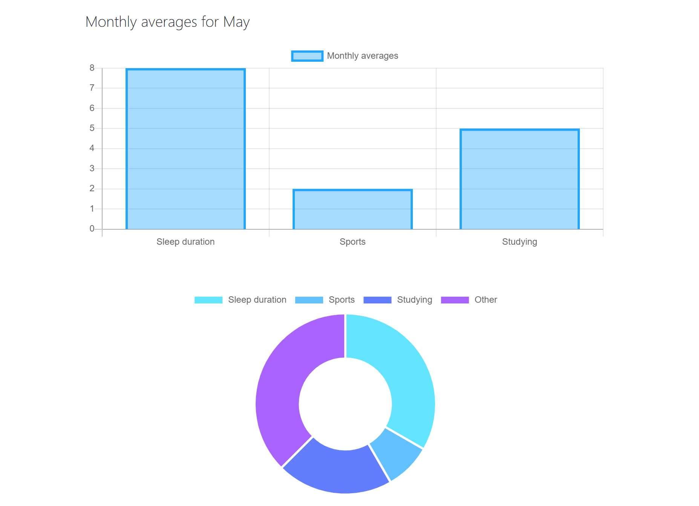

# Self-monitoring app

Self-monitoring app is a web application built with Deno runtime, Oak middleware framework, EJS templates and PostgreSQL. This project was built for the Aalto University course CS-C3170 - Web Software Development.

Here are some screenshots from the application:

The home page:



Adding new entry:



The summary page:



The application provides users an opportunity to report their behavior daily. The behavior reported to the application are as follows:
  * Sleep duration and sleep quality
  * Time spent on sports and exercise
  * Time spent studying
  * Regularity and quality of eating
  * Generic mood

The application contains 5 pages:
- Landing page (contains some average data of all users from yesterday and today if there is data available)
- Registration page
- Login page
- Page for reporting daily activities. There are separate forms for reporting morning and evening activity.
- Summary page visualizes the data using `Chart.js` graphs.

The directory structure is as follows:
```
.
├── config
│   └── config.js
├── database
│   ├── createTables.sql
│   └── database.js
├── flyway
│   └── sql
│       └── V1__initial_database.sql
├── middlewares
│   ├── accessControl.js
│   ├── logging.js
│   └── serveFiles.js
├── routes
│   ├── apis
│   │   └── summaryApi.js
│   ├── controllers
│   │   ├── indexController.js
│   │   ├── reportController.js
│   │   ├── summaryController.js
│   │   └── userController.js
│   └── routes.js
├── services
│   ├── eatingService.js
│   ├── moodService.js
│   ├── sleepService.js
│   ├── sportService.js
│   ├── studyService.js
│   └── userService.js
├── static
│   ├── css
│   │   └── styles.css
│   ├── images
│   │   └── pie-graph.svg
│   └── javascripts
│       └── chart.js
├── test
│   └── user_test.js
├── utils
│   ├── dates.js
│   └── validation.js
├── views
│   ├── partials
│   │   ├── error.ejs
│   │   ├── footer.ejs
│   │   └── header.ejs
│   ├── add-report.ejs
│   ├── index.ejs
│   ├── login.ejs
│   ├── register.ejs
│   └── summary.ejs
├── Dockerfile
├── Procfile
├── README.md
├── app.js
├── deps.js
├── docker-compose.yml
├── database.env-template
└── runtime.txt
```
## Important for running locally
deno-postgres doesn't seem to be compatible with the newest `Deno version (v1.6, January 2021)`. The app works fine with for example `v1.5.2`.

The app can be run with `Docker compose` or by installing the dependencies yourself.

## With Docker compose
Create a database.env file in the project's root directory. There is a template in file `database.env-template` which you can copy to database.env and fill the database credentials there.

Build the application by running
```
docker-compose build
```
in the project's root directory (which contains docker-compose.yml file).

Run the application with
```
docker-compose up
```
The app runs on port `7777`.

## Installing dependencies and running locally

### Prerequisites
- Install [Deno](https://deno.land/)
- The project uses a PostgreSQL database. An easy way for setting up a database is [ElephantSQL](https://www.elephantsql.com/).
- Copy the contents of `database/createTables.sql`. The file contains the necessary CREATE TABLE commands for setting up the database. Run the commands to a PostgreSQL database.
- IMPORTANT: To run locally, create .env file in the project's root directory. The file should contain the following lines. Append each row in .env file with your PostgreSQL database credentials. 
```
DB_HOST=
DB_USER=
DB_NAME=
DB_PASSWORD=
DB_PORT=5432
```
- Also, if you want to run tests locally, you need to set up anohter PostgreSQL database and add the following lines to the .env file appended with your custom database credentials:
```
TEST_DB_HOST=
TEST_DB_USER=
TEST_DB_NAME=
TEST_DB_PASSWORD=
TEST_DB_PORT=5432
```
### Running the application
The program can be locally run from the directory's root folder with the command:
```
deno run --allow-net --allow-env --allow-read --unstable app.js
```
The --unstable flag is required because brcypt library for Deno uses some new features of Deno. The app runs on port `7777`.

Tests can be run with the following command:
```
TEST=true deno test --allow-all
```

## Known issues
The summary page of the application uses input elements of type month and week. Those are not supported by the desktop version of Firefox as of 05/2021.
